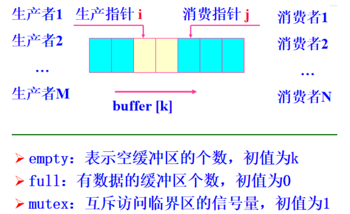

# 实验三 生产者消费者问题

## 一、实验目的

使用信号量和虚拟缓冲区及P、V操作来模拟操作系统调度进程访问临界区，并使资源正确分配。


## 二、 实验内容

* 创建一个有6个缓冲区的缓冲池，初始为空，每个缓冲区能存放一个长度若为10个字符的字符串。
* 2个生产者进程

  * 随机等待一段时间，往缓冲区添加数据
  * 若缓冲区已满，等待消费者取走数据后再添加
  * 重复12次
  
* 3个消费者进程
  * 随机等待一段时间，从缓冲区读取数据
  * 若缓冲区为空，等待生产者添加数据后再读取
  * 重复8次
  
说明：  
* 在Windows平台上做。
* 显示每次添加或读取数据的时间及缓冲区的映像。
* 生产者和消费者用进程模拟。


## 三、实验步骤


### 核心思路:

1. 设置生产者的信号量empty,其初值为n,表示开始时有n个空缓冲区；
2. 设置消费者的信号量 full ,初值为0表示开始时有0个满缓冲区；
3. 只要有空的缓冲区，生产者便可将产品送入缓冲区；
4. 只要有满的缓冲区，消费者便可从缓冲区取走一个产品。
5. 用互斥信号量 mutex 来实现对缓冲区 ( 共享变量 in 和 out) 的互斥使用，互斥信号量 mutex 初值为 1 ；
6. 生产者用共享变量in_point作为下标访问缓冲区；消费者用共享变量 out_point作为下标访问缓冲区。

### 具体实现：

#### （一）初始化

1. 定义宏，  
  * BUFFER_SIZE ：缓冲区个数  
  * PRODUCT_SIZE ：每个缓冲区大小（由于使用的char数组，'\0'的存在，所以设为11）  
  * MAX_PRO_ITEMS ：每个生产者最多生产的产品数  
  * MAX_CON_ITEMS ：每个消费者最多消费的产品数  
  * NUM_PRODUCERS ：生产者数量  
  * NUM_CONSUMERS ：消费者数量  

```c
#define BUFFER_SIZE 6
#define PRODUCT_SIZE 11
#define MAX_PRO_ITEMS 12
#define MAX_CON_ITEMS 8
#define NUM_PRODUCERS 2
#define NUM_CONSUMERS 3
```

2. 声明信号量mutex、empty、full，字符数组buffer代表缓冲区，in_point、out_point、old_in_point分别代表写、读、上一次写指针。
```c
sem_t mutex;
sem_t empty;
sem_t full;

char buffer[BUFFER_SIZE][PRODUCT_SIZE];
int in_point=0;
int out_point=0;
int old_in_point=0;
```

3. 生产者进程
* 思路:
* (1) 对每个生产者的每次生产过程使用Sleep函数随机睡眠几毫秒，然后开始放数据
* (2) 首先P(empty),P(mutex)
* (3) 其次放产品到in_point指针所指处，然后在控制台输出放数据时间、产品内容及当前缓冲区映像
* (4) 再次将in_point指针后移，由于采用的是循环数组，注意取模
* (5) 最后V(mutex),V(full)

* 具体地:
* (1)使用Windows头文件自带的Sleep函数来实现随机等待
```c
Sleep(rand() % 1000*10);
```
* (2)P(empty)、P(mutex)
```c
sem_wait(&empty);
sem_wait(&mutex);
```

* (3)将产生的产品放入缓冲区，这里为了直观，将每个生产者的每次产品内容设为“Pro + pro_id + 's + product_id”
```c
string content="Pro"+to_string(id)+" 's "+to_string(i);
const char *product=content.data();
strcpy(buffer[in_point],product);
```
* (4)使用Windows自带库函数来获取当前时间，并和产品生产信息一起输出到终端上
```c
SYSTEMTIME time;
GetLocalTime(&time); // 得到当前系统时间
printf("\n时间: %02d:%02d:%02d:%d  ", time.wHour, time.wMinute, time.wSecond, time.wMilliseconds);
printf("Producer %d produced %d\n", id, i);
```
* (5)将in_point指针后移，记录上一次写指针位置（便于后续判断缓冲区是满还是空）
```c
old_in_point=in_point;
in_point=(in_point+1)%BUFFER_SIZE;
```
* (6)输出缓冲区映像，输出从out_point指针到in_point指针的环形缓冲区的内容
```c
cout<<"缓冲区映像:|";
        for(int i=0;i<BUFFER_SIZE;i++){
            if(in_point>out_point){
                if(i>=out_point&&i<in_point)    printf("%-10s|",buffer[i]);
                else    printf("%-10s|","");
            }else if(in_point<out_point){
                if(i>=out_point||i<in_point)    printf("%-10s|",buffer[i]);
                else    printf("%-10s|","");
            }else{
                if(out_point==(old_in_point+1)%BUFFER_SIZE) printf("%-10s|",buffer[i]);
                else printf("%-10s|","");
            }
            
        }
        cout<<endl;
```
* (7)V(mutex)、V(full)
```c
sem_post(&mutex);
sem_post(&full);
```

生产者进程代码：
```c
void *producer(void *arg) {
    
    int id=*(int*)arg;
    for (int i=0;i<MAX_PRO_ITEMS;i++) {
        Sleep(rand() % 1000*10);    

        sem_wait(&empty);
        sem_wait(&mutex);

        string content="Pro"+to_string(id)+" 's "+to_string(i);
        const char *product=content.data();
        strcpy(buffer[in_point],product);
        
        SYSTEMTIME time;
        GetLocalTime(&time); // 得到当前系统时间
        printf("\n时间: %02d:%02d:%02d:%d  ", time.wHour, time.wMinute, time.wSecond, time.wMilliseconds);
        printf("Producer %d produced %d\n", id, i);
        old_in_point=in_point;
        in_point=(in_point+1)%BUFFER_SIZE;

        cout<<"缓冲区映像:|";
        for(int i=0;i<BUFFER_SIZE;i++){
            
            if(in_point>out_point){
                if(i>=out_point&&i<in_point)    printf("%-10s|",buffer[i]);
                else    printf("%-10s|","");
            }else if(in_point<out_point){
                if(i>=out_point||i<in_point)    printf("%-10s|",buffer[i]);
                else    printf("%-10s|","");
            }else{
                if(out_point==(old_in_point+1)%BUFFER_SIZE) printf("%-10s|",buffer[i]);
                else printf("%-10s|","");
            }
            
        }
        cout<<endl;

        sem_post(&mutex);
        sem_post(&full);
    }
    return NULL;
}

```

4. 消费者进程
* 思路:
* (1) 对每个消费者的每次消费过程使用Sleep函数随机睡眠几毫秒，然后开始取数据
* (2) 首先P(full),P(mutex)
* (3) 其次从out_point指针所指处取产品，然后在控制台输出取数据时间、产品内容及当前缓冲区映像
* (4) 再次将out_point指针后移，由于采用的是循环数组，注意取模
* (5) 最后V(mutex),V(empty)

* 具体地:
* (1)使用Windows头文件自带的Sleep函数来实现随机等待
```c
Sleep(rand() % 1000*10);
```
* (2)P(full)、P(mutex)
```c
sem_wait(&full);
sem_wait(&mutex);
```

* (3)从缓冲区获取产品
```c
const char *item;
item = buffer[out_point];
```
* (4)使用Windows自带库函数来获取当前时间，并和产品消费信息一起输出到终端上
```c
SYSTEMTIME time;
GetLocalTime(&time); // 得到当前系统时间
printf("\n时间: %02d:%02d:%02d:%d  ", time.wHour, time.wMinute, time.wSecond, time.wMilliseconds);
printf("Consumer %d consumed %s\n", id, item);
```
* (5)将out_point指针后移，并更新old_in_point（因为本次操作是消费）
```c
out_point=(out_point+1)%BUFFER_SIZE;
old_in_point=in_point;
```
* (6)输出缓冲区映像，输出从out_point指针到in_point指针的环形缓冲区的内容
```c
cout<<"缓冲区映像:|";
        for(int i=0;i<BUFFER_SIZE;i++){
            if(in_point>out_point){
                if(i>=out_point&&i<in_point)    printf("%-10s|",buffer[i]);
                else    printf("%-10s|","");
            }else if(in_point<out_point){
                if(i>=out_point||i<in_point)    printf("%-10s|",buffer[i]);
                else    printf("%-10s|","");
            }else{
                if(out_point==(old_in_point+1)%BUFFER_SIZE) printf("%-10s|",buffer[i]);
                else printf("%-10s|","");
            }
            
        }
        cout<<endl;
```
* (7)V(mutex)、V(empty)
```c
sem_post(&mutex);
sem_post(&empty);
```

消费者进程代码：
```c
void *consumer(void *arg) {
    
    int id=*(int*)arg;
    const char *item;
    for (int i=0;i<MAX_CON_ITEMS;i++) {
        Sleep(rand() % 10000*10);    
        
        sem_wait(&full);
        sem_wait(&mutex);

        SYSTEMTIME time;
        GetLocalTime(&time); // 得到当前系统时间
        printf("\n时间: %02d:%02d:%02d:%d  ", time.wHour, time.wMinute, time.wSecond, time.wMilliseconds);
        item = buffer[out_point];
        printf("Consumer %d consumed %s\n", id, item);
        out_point=(out_point+1)%BUFFER_SIZE;
        old_in_point=in_point;
        cout<<"缓冲区映像:|";
        for(int i=0;i<BUFFER_SIZE;i++){
            
            if(in_point>out_point){
                if(i>=out_point&&i<in_point)    printf("%-10s|",buffer[i]);
                else    printf("%-10s|","");
            }else if(in_point<out_point){
                if(i>=out_point||i<in_point)    printf("%-10s|",buffer[i]);
                else    printf("%-10s|","");
            }else{
                if(out_point==(old_in_point+1)%BUFFER_SIZE) printf("%-10s|",buffer[i]);
                else printf("%-10s|","");
            }
            
        }
        cout<<endl;
        
        sem_post(&mutex);
        sem_post(&empty);
    }
    return NULL;
}
```
5. 主函数

* 思路：
* 先对mutex、empty、full三个信号量分别初始化为1、6、0，然后为每个生产者和消费者编号
* 再为每个生产者和每个消费者使用pthread_create创建线程，并使用pthread_join调用，程序开始运行
* 最后销毁三个信号量
```c
int main() {
    sem_init(&mutex, 0, 1);
    sem_init(&empty, 0, BUFFER_SIZE);
    sem_init(&full, 0, 0);

    int producer_ids[NUM_PRODUCERS];
    int consumer_ids[NUM_CONSUMERS];
    pthread_t producers[NUM_PRODUCERS];
    pthread_t consumers[NUM_CONSUMERS];

    for (int i=0;i<NUM_PRODUCERS;i++){
        producer_ids[i]=i;
        pthread_create(&producers[i],NULL,producer,&producer_ids[i]);
    }

    for (int i=0;i<NUM_CONSUMERS;i++){
        consumer_ids[i]=i;
        pthread_create(&consumers[i],NULL,consumer,&consumer_ids[i]);
    }

    for (int i=0;i<NUM_PRODUCERS;i++){
        pthread_join(producers[i],NULL);
    }

    for (int i=0;i<NUM_CONSUMERS;i++){
        pthread_join(consumers[i],NULL);
    }

    sem_destroy(&mutex);
    sem_destroy(&empty);
    sem_destroy(&full);

    return 0;
}
```

全部代码：
```c
#include <iostream>
#include <pthread.h>
#include <semaphore.h>
#include <cstdio>
#include <cstdlib>
#include <cstring>
#include <time.h>
#include <windows.h>

using namespace std;

#define BUFFER_SIZE 6
#define PRODUCT_SIZE 11
#define MAX_PRO_ITEMS 12
#define MAX_CON_ITEMS 8
#define NUM_PRODUCERS 2
#define NUM_CONSUMERS 3


sem_t mutex;
sem_t empty;
sem_t full;

char buffer[BUFFER_SIZE][PRODUCT_SIZE];
int in_point=0;
int out_point=0;
int old_in_point=0;

void *producer(void *arg) {
    
    int id=*(int*)arg;
    for (int i=0;i<MAX_PRO_ITEMS;i++) {
        Sleep(rand() % 1000*10);    

        sem_wait(&empty);
        sem_wait(&mutex);

        string content="Pro"+to_string(id)+" 's "+to_string(i);
        const char *product=content.data();
        strcpy(buffer[in_point],product);
        
        SYSTEMTIME time;
        GetLocalTime(&time); // 得到当前系统时间
        printf("\n时间: %02d:%02d:%02d:%d  ", time.wHour, time.wMinute, time.wSecond, time.wMilliseconds);
        printf("Producer %d produced %d\n", id, i);
        old_in_point=in_point;
        in_point=(in_point+1)%BUFFER_SIZE;

        cout<<"缓冲区映像:|";
        for(int i=0;i<BUFFER_SIZE;i++){
            
            if(in_point>out_point){
                if(i>=out_point&&i<in_point)    printf("%-10s|",buffer[i]);
                else    printf("%-10s|","");
            }else if(in_point<out_point){
                if(i>=out_point||i<in_point)    printf("%-10s|",buffer[i]);
                else    printf("%-10s|","");
            }else{
                if(out_point==(old_in_point+1)%BUFFER_SIZE) printf("%-10s|",buffer[i]);
                else printf("%-10s|","");
            }
            
        }
        cout<<endl;

        sem_post(&mutex);
        sem_post(&full);
    }
    return NULL;
}

void *consumer(void *arg) {
    
    int id=*(int*)arg;
    const char *item;
    for (int i=0;i<MAX_CON_ITEMS;i++) {
        Sleep(rand() % 10000*10);    
        
        sem_wait(&full);
        sem_wait(&mutex);

        SYSTEMTIME time;
        GetLocalTime(&time); // 得到当前系统时间
        printf("\n时间: %02d:%02d:%02d:%d  ", time.wHour, time.wMinute, time.wSecond, time.wMilliseconds);
        item = buffer[out_point];
        printf("Consumer %d consumed %s\n", id, item);
        out_point=(out_point+1)%BUFFER_SIZE;
        old_in_point=in_point;
        cout<<"缓冲区映像:|";
        for(int i=0;i<BUFFER_SIZE;i++){
            
            if(in_point>out_point){
                if(i>=out_point&&i<in_point)    printf("%-10s|",buffer[i]);
                else    printf("%-10s|","");
            }else if(in_point<out_point){
                if(i>=out_point||i<in_point)    printf("%-10s|",buffer[i]);
                else    printf("%-10s|","");
            }else{
                if(out_point==(old_in_point+1)%BUFFER_SIZE) printf("%-10s|",buffer[i]);
                else printf("%-10s|","");
            }
            
        }
        cout<<endl;
        
        sem_post(&mutex);
        sem_post(&empty);
    }
    return NULL;
}

int main() {
    sem_init(&mutex, 0, 1);
    sem_init(&empty, 0, BUFFER_SIZE);
    sem_init(&full, 0, 0);

    int producer_ids[NUM_PRODUCERS];
    int consumer_ids[NUM_CONSUMERS];
    pthread_t producers[NUM_PRODUCERS];
    pthread_t consumers[NUM_CONSUMERS];

    for (int i=0;i<NUM_PRODUCERS;i++){
        producer_ids[i]=i;
        pthread_create(&producers[i],NULL,producer,&producer_ids[i]);
    }

    for (int i=0;i<NUM_CONSUMERS;i++){
        consumer_ids[i]=i;
        pthread_create(&consumers[i],NULL,consumer,&consumer_ids[i]);
    }

    for (int i=0;i<NUM_PRODUCERS;i++){
        pthread_join(producers[i],NULL);
    }

    for (int i=0;i<NUM_CONSUMERS;i++){
        pthread_join(consumers[i],NULL);
    }

    sem_destroy(&mutex);
    sem_destroy(&empty);
    sem_destroy(&full);

    return 0;
}

```

## 四、实验结果及分析

### 实验结果：
```c
/*
时间: 17:00:58:621  Producer 0 produced 0
缓冲区映像:|Pro0 's 0 |          |          |          |          |          |

时间: 17:00:58:624  Producer 1 produced 0
缓冲区映像:|Pro0 's 0 |Pro1 's 0 |          |          |          |          |

时间: 17:00:58:627  Consumer 1 consumed Pro0 's 0
缓冲区映像:|          |Pro1 's 0 |          |          |          |          |

时间: 17:00:58:630  Consumer 0 consumed Pro1 's 0
缓冲区映像:|          |          |          |          |          |          |

时间: 17:01:03:305  Producer 1 produced 1
缓冲区映像:|          |          |Pro1 's 1 |          |          |          |

时间: 17:01:03:308  Producer 0 produced 1
缓冲区映像:|          |          |Pro1 's 1 |Pro0 's 1 |          |          |

时间: 17:01:03:311  Consumer 2 consumed Pro1 's 1
缓冲区映像:|          |          |          |Pro0 's 1 |          |          |

时间: 17:01:06:655  Producer 1 produced 2
缓冲区映像:|          |          |          |Pro0 's 1 |Pro1 's 2 |          |

时间: 17:01:06:658  Producer 0 produced 2
缓冲区映像:|          |          |          |Pro0 's 1 |Pro1 's 2 |Pro0 's 2 |

时间: 17:01:11:658  Producer 1 produced 3
缓冲区映像:|Pro1 's 3 |          |          |Pro0 's 1 |Pro1 's 2 |Pro0 's 2 |

时间: 17:01:11:674  Producer 0 produced 3
缓冲区映像:|Pro1 's 3 |Pro0 's 3 |          |Pro0 's 1 |Pro1 's 2 |Pro0 's 2 |

时间: 17:01:13:366  Producer 1 produced 4
缓冲区映像:|Pro1 's 3 |Pro0 's 3 |Pro1 's 4 |Pro0 's 1 |Pro1 's 2 |Pro0 's 2 |

时间: 17:02:23:316  Consumer 0 consumed Pro0 's 1
缓冲区映像:|Pro1 's 3 |Pro0 's 3 |Pro1 's 4 |          |Pro1 's 2 |Pro0 's 2 |

时间: 17:02:23:320  Consumer 1 consumed Pro1 's 2
缓冲区映像:|Pro1 's 3 |Pro0 's 3 |Pro1 's 4 |          |          |Pro0 's 2 |

时间: 17:02:23:322  Producer 0 produced 4
缓冲区映像:|Pro1 's 3 |Pro0 's 3 |Pro1 's 4 |Pro0 's 4 |          |Pro0 's 2 |

时间: 17:02:23:325  Producer 1 produced 5
缓冲区映像:|Pro1 's 3 |Pro0 's 3 |Pro1 's 4 |Pro0 's 4 |Pro1 's 5 |Pro0 's 2 |

时间: 17:02:27:990  Consumer 2 consumed Pro0 's 2
缓冲区映像:|Pro1 's 3 |Pro0 's 3 |Pro1 's 4 |Pro0 's 4 |Pro1 's 5 |          |

时间: 17:02:28:115  Producer 1 produced 6
缓冲区映像:|Pro1 's 3 |Pro0 's 3 |Pro1 's 4 |Pro0 's 4 |Pro1 's 5 |Pro1 's 6 |

时间: 17:03:26:662  Consumer 0 consumed Pro1 's 3
缓冲区映像:|          |Pro0 's 3 |Pro1 's 4 |Pro0 's 4 |Pro1 's 5 |Pro1 's 6 |

时间: 17:03:26:665  Producer 0 produced 5
缓冲区映像:|Pro0 's 5 |Pro0 's 3 |Pro1 's 4 |Pro0 's 4 |Pro1 's 5 |Pro1 's 6 |

时间: 17:03:26:677  Consumer 1 consumed Pro0 's 3
缓冲区映像:|Pro0 's 5 |          |Pro1 's 4 |Pro0 's 4 |Pro1 's 5 |Pro1 's 6 |

时间: 17:03:26:680  Producer 1 produced 7
缓冲区映像:|Pro0 's 5 |Pro1 's 7 |Pro1 's 4 |Pro0 's 4 |Pro1 's 5 |Pro1 's 6 |

时间: 17:03:31:344  Consumer 2 consumed Pro1 's 4
缓冲区映像:|Pro0 's 5 |Pro1 's 7 |          |Pro0 's 4 |Pro1 's 5 |Pro1 's 6 |

时间: 17:03:31:453  Producer 0 produced 6
缓冲区映像:|Pro0 's 5 |Pro1 's 7 |Pro0 's 6 |Pro0 's 4 |Pro1 's 5 |Pro1 's 6 |

时间: 17:04:31:680  Consumer 0 consumed Pro0 's 4
缓冲区映像:|Pro0 's 5 |Pro1 's 7 |Pro0 's 6 |          |Pro1 's 5 |Pro1 's 6 |

时间: 17:04:31:683  Producer 0 produced 7
缓冲区映像:|Pro0 's 5 |Pro1 's 7 |Pro0 's 6 |Pro0 's 7 |Pro1 's 5 |Pro1 's 6 |

时间: 17:04:31:696  Consumer 1 consumed Pro1 's 5
缓冲区映像:|Pro0 's 5 |Pro1 's 7 |Pro0 's 6 |Pro0 's 7 |          |Pro1 's 6 |

时间: 17:04:31:700  Producer 1 produced 8
缓冲区映像:|Pro0 's 5 |Pro1 's 7 |Pro0 's 6 |Pro0 's 7 |Pro1 's 8 |Pro1 's 6 |

时间: 17:04:36:349  Consumer 2 consumed Pro1 's 6
缓冲区映像:|Pro0 's 5 |Pro1 's 7 |Pro0 's 6 |Pro0 's 7 |Pro1 's 8 |          |

时间: 17:04:36:352  Producer 1 produced 9
缓冲区映像:|Pro0 's 5 |Pro1 's 7 |Pro0 's 6 |Pro0 's 7 |Pro1 's 8 |Pro1 's 9 |

时间: 17:06:03:378  Consumer 0 consumed Pro0 's 5
缓冲区映像:|          |Pro1 's 7 |Pro0 's 6 |Pro0 's 7 |Pro1 's 8 |Pro1 's 9 |

时间: 17:06:03:381  Producer 0 produced 8
缓冲区映像:|Pro0 's 8 |Pro1 's 7 |Pro0 's 6 |Pro0 's 7 |Pro1 's 8 |Pro1 's 9 |

时间: 17:06:03:393  Consumer 1 consumed Pro1 's 7
缓冲区映像:|Pro0 's 8 |          |Pro0 's 6 |Pro0 's 7 |Pro1 's 8 |Pro1 's 9 |

时间: 17:06:03:396  Producer 1 produced 10
缓冲区映像:|Pro0 's 8 |Pro1 's 10|Pro0 's 6 |Pro0 's 7 |Pro1 's 8 |Pro1 's 9 |

时间: 17:06:08:57  Consumer 2 consumed Pro0 's 6
缓冲区映像:|Pro0 's 8 |Pro1 's 10|          |Pro0 's 7 |Pro1 's 8 |Pro1 's 9 |

时间: 17:06:08:60  Producer 1 produced 11
缓冲区映像:|Pro0 's 8 |Pro1 's 10|Pro1 's 11|Pro0 's 7 |Pro1 's 8 |Pro1 's 9 |

时间: 17:07:00:629  Consumer 0 consumed Pro0 's 7
缓冲区映像:|Pro0 's 8 |Pro1 's 10|Pro1 's 11|          |Pro1 's 8 |Pro1 's 9 |

时间: 17:07:00:632  Producer 0 produced 9
缓冲区映像:|Pro0 's 8 |Pro1 's 10|Pro1 's 11|Pro0 's 9 |Pro1 's 8 |Pro1 's 9 |

时间: 17:07:00:645  Consumer 1 consumed Pro1 's 8
缓冲区映像:|Pro0 's 8 |Pro1 's 10|Pro1 's 11|Pro0 's 9 |          |Pro1 's 9 |

时间: 17:07:05:315  Consumer 2 consumed Pro1 's 9
缓冲区映像:|Pro0 's 8 |Pro1 's 10|Pro1 's 11|Pro0 's 9 |          |          |

时间: 17:07:07:696  Producer 0 produced 10
缓冲区映像:|Pro0 's 8 |Pro1 's 10|Pro1 's 11|Pro0 's 9 |Pro0 's 10|          |

时间: 17:07:09:165  Producer 0 produced 11
缓冲区映像:|Pro0 's 8 |Pro1 's 10|Pro1 's 11|Pro0 's 9 |Pro0 's 10|Pro0 's 11|

时间: 17:07:15:420  Consumer 0 consumed Pro0 's 8
缓冲区映像:|          |Pro1 's 10|Pro1 's 11|Pro0 's 9 |Pro0 's 10|Pro0 's 11|

时间: 17:07:15:435  Consumer 1 consumed Pro1 's 10
缓冲区映像:|          |          |Pro1 's 11|Pro0 's 9 |Pro0 's 10|Pro0 's 11|

时间: 17:07:20:113  Consumer 2 consumed Pro1 's 11
缓冲区映像:|          |          |          |Pro0 's 9 |Pro0 's 10|Pro0 's 11|

时间: 17:08:49:15  Consumer 0 consumed Pro0 's 9
缓冲区映像:|          |          |          |          |Pro0 's 10|Pro0 's 11|

时间: 17:08:49:30  Consumer 1 consumed Pro0 's 10
缓冲区映像:|          |          |          |          |          |Pro0 's 11|

时间: 17:08:53:711  Consumer 2 consumed Pro0 's 11
缓冲区映像:|          |          |          |          |          |          |
*/
```


### 分析：

由于整个过程较长，现截取一部分进行说明
```c
/*
时间: 17:01:06:658  Producer 0 produced 2
缓冲区映像:|          |          |          |Pro0 's 1 |Pro1 's 2 |Pro0 's 2 |

由于Producer 0 produced 2，当前in_point=5,所以buffer[5]=Pro0 's 2

时间: 17:01:11:658  Producer 1 produced 3
缓冲区映像:|Pro1 's 3 |          |          |Pro0 's 1 |Pro1 's 2 |Pro0 's 2 |

由于Producer 1 produced 3，当前in_point=0,所以buffer[0]=Pro1 's 3

时间: 17:01:11:674  Producer 0 produced 3
缓冲区映像:|Pro1 's 3 |Pro0 's 3 |          |Pro0 's 1 |Pro1 's 2 |Pro0 's 2 |

由于Producer 0 produced 3，当前in_point=1,所以buffer[1]=Pro0 's 3

时间: 17:01:13:366  Producer 1 produced 4
缓冲区映像:|Pro1 's 3 |Pro0 's 3 |Pro1 's 4 |Pro0 's 1 |Pro1 's 2 |Pro0 's 2 |

由于Producer 1 produced 4，当前in_point=2,所以buffer[2]=Pro1 's 4

时间: 17:02:23:316  Consumer 0 consumed Pro0 's 1
缓冲区映像:|Pro1 's 3 |Pro0 's 3 |Pro1 's 4 |          |Pro1 's 2 |Pro0 's 2 |

由于Consumer 0 consumed Pro0 's 1，当前out_point=3,所以buffer[3]内容被取出

时间: 17:02:23:320  Consumer 1 consumed Pro1 's 2
缓冲区映像:|Pro1 's 3 |Pro0 's 3 |Pro1 's 4 |          |          |Pro0 's 2 |

由于Consumer 1 consumed Pro1 's 2，当前out_point=4,所以buffer[4]内容被取出

时间: 17:02:23:322  Producer 0 produced 4
缓冲区映像:|Pro1 's 3 |Pro0 's 3 |Pro1 's 4 |Pro0 's 4 |          |Pro0 's 2 |

由于Producer 0 produced 4，当前in_point=3,所以buffer[3]=Pro0 's 4

时间: 17:02:23:325  Producer 1 produced 5
缓冲区映像:|Pro1 's 3 |Pro0 's 3 |Pro1 's 4 |Pro0 's 4 |Pro1 's 5 |Pro0 's 2 |

由于Producer 1 produced 5，当前in_point=4,所以buffer[4]=Pro1 's 5

时间: 17:02:27:990  Consumer 2 consumed Pro0 's 2
缓冲区映像:|Pro1 's 3 |Pro0 's 3 |Pro1 's 4 |Pro0 's 4 |Pro1 's 5 |          |

由于Consumer 2 consumed Pro0 's 2，当前out_point=5,所以buffer[5]内容被取出
*/
```

## 五、实验收获与体会

通过本次上机实验，我加深了对课上老师讲解的知识点的理解，并成功将其部署到windows系统上运行，这样一来，既加深了对知识点的印象，又锻炼了我的代码能力，收获颇丰。


